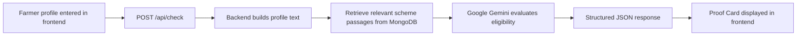

# Niti-Setu

> An AI-assisted eligibility engine for Indian agricultural schemes.

Niti-Setu helps farmers understand whether they qualify for schemes such as PM-KISAN, PM-KMY, and PM-KUSUM by combining a guided React experience, a Node.js API, MongoDB storage, and retrieval over official scheme documents.

## At a Glance

| Layer | Stack |
| --- | --- |
| Frontend | React, Vite, Tailwind CSS |
| Backend | Node.js, Express, Mongoose |
| AI / RAG | LangChain, Google Gemini, MongoDB Atlas Vector Search |
| Storage | MongoDB |
| Deployment | Vercel-ready backend |

## What It Does

- Collects farmer details through a polished step-by-step UI.
- Compares profiles against official PDF guidelines.
- Produces a structured verdict with status, reasoning, proof text, citation, and required documents.
- Falls back to deterministic rules when the AI or retrieval layer is unavailable.
- Stores farmer profiles in MongoDB when the database is online.

## Supported Schemes

- PM-KISAN
- PM-KMY
- PM-KUSUM

## Repository Layout

```text
.
|-- backend/        Express API, MongoDB models, RAG logic, scheme data
|-- frontend/       Vite app, UI components, assets, and styling
|-- doc/            Project notes and supporting documents
`-- PDF/            Reference material
```

## How It Works



## Requirements

- Node.js 18 or newer
- npm
- MongoDB Atlas or another MongoDB instance
- Google Gemini API key

## Environment Setup

Create `backend/.env`:

```env
PORT=5001
MONGODB_URI=mongodb+srv://<username>:<password>@cluster0.mongodb.net/?retryWrites=true&w=majority
GOOGLE_API_KEY=your_gemini_api_key_here
```

Optional `frontend/.env` or `frontend/.env.production`:

```env
VITE_API_URL=http://localhost:5001
```

If `VITE_API_URL` is not set, the frontend uses `http://localhost:5001/api/check`.

## Quick Start

### 1. Install dependencies

```bash
cd backend
npm install

cd ../frontend
npm install
```

### 2. Start the backend

```bash
cd backend
npm start
```

### 3. Start the frontend

```bash
cd frontend
npm run dev
```

Vite will show the local URL, usually `http://localhost:5173`.

## API Endpoints

| Method | Endpoint | Purpose |
| --- | --- | --- |
| `GET` | `/api/health` | Health check and database status |
| `POST` | `/api/check` | Run scheme eligibility analysis |
| `POST` | `/api/profile` | Create a farmer profile |
| `GET` | `/api/profile` | List saved profiles |
| `GET` | `/api/profile/:id` | Fetch one profile |
| `PUT` | `/api/profile/:id` | Update a profile |
| `DELETE` | `/api/profile/:id` | Delete a profile |

## Response Shape

The eligibility endpoint returns a response like this:

```json
{
  "success": true,
  "message": "Eligibility checked successfully.",
  "data": {
    "status": "Eligible",
    "reasoning": "Short explanation in the selected language.",
    "document_proof": "Verbatim supporting text from the source document.",
    "citation": "Source document name",
    "required_documents": ["Aadhaar Card", "Land Record", "Bank Passbook"]
  }
}
```

## Project Notes

- The frontend uses a landing page plus a consultation flow.
- The backend includes a rules-based fallback so the app remains usable if RAG is unavailable.
- Scheme documents live in `backend/data/` and are used to support retrieval and citations.
- The backend is configured for serverless deployment through `vercel.json`.

## Deployment

### Backend

- Set production environment variables in your hosting provider.
- Ensure `MONGODB_URI` and `GOOGLE_API_KEY` are available at runtime.

### Frontend

- Point `VITE_API_URL` to the deployed backend.
- Rebuild after changing production environment variables.

## Tips

- Keep the backend and frontend running at the same time during local development.
- If the UI cannot reach the API, check the backend port and the `VITE_API_URL` value.
- If eligibility returns fallback output, verify MongoDB connectivity and the Gemini API key.
