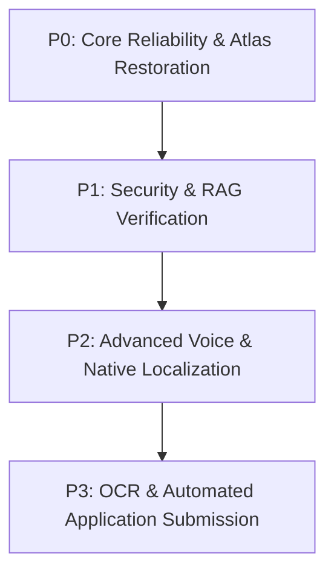

# Niti-Setu — Product Development Roadmap

---

## Strategic Priority Levels
- **P0 — Critical**: Immediate blockers and core system reliability.
- **P1 — High**: Security, accuracy, and primary RAG restoration.
- **P2 — Medium**: User experience, voice refinement, and native localization.
- **P3 — Future**: Advanced capabilities, OCR scanning, and external portal integrations.

---

## 🗺️ Prioritized Roadmap Execution Plan

---

### P0 — Critical (Immediate Technical Blockers)

#### 1. Problem & Core Validation `[IMPLEMENTED]`
- Validate farmer eligibility problem statement, scheme requirements (PM-KISAN, PM-KMY, PM-KUSUM), and Proof Card UX concept.

#### 2. Architecture Cleanup `[P0 - Critical]` `[IN PROGRESS]`
- Refactor backend from monolithic `routes/eligibility.js` into distinct Controller, Service, and Repository modules.
- Standardize JSON API response payloads across all HTTP endpoints.

#### 3. Data Model Definition `[P0 - Critical]` `[IMPLEMENTED]`
- Enforce Mongoose schemas with sparse unique indexes for optional Aadhaar and phone fields.

#### 4. MongoDB Atlas Vector Network Rebuild `[P0 - Critical]` `[IN PROGRESS]` `[BLOCKED]`
- Resolve Atlas Cloud IP whitelist permissions (`0.0.0.0/0` for dev environment) and fix DNS SRV lookup string to eliminate `querySrv ETIMEOUT` connection failures.

---

### P1 — High (Core System Accuracy & Security)

#### 5. RAG Reconstruction & Vector Ingestion `[P1 - High]` `[PLANNED]`
- Execute PDF ingestion scripts (`ingest_pdf.cjs`) for all official scheme guidelines, populating 768-dimensional vector chunks into `scheme_documents`.
- Verify live RAG retrieval performance (`node test_rag.cjs`).

#### 6. Eligibility Engine Expansion `[P1 - High]` `[PLANNED]`
- Expand deterministic fallback rule dictionaries to cover additional central schemes (e.g., PM Fasal Bima Yojana, Soil Health Card Scheme).

#### 7. Evidence Verification & Citation Audit `[P1 - High]` `[PLANNED]`
- Implement verification tests to guarantee that verbatim quotes returned by Gemini 1.5 Pro exactly match ingested PDF text chunks without hallucination.

#### 8. Security Hardening & Rate Limiting `[P1 - High]` `[PLANNED]`
- Attach `express-rate-limit` middleware to prevent Gemini API quota exhaustion.
- Mask/hash sensitive identity numbers (Aadhaar/Phone) stored in database collections.

---

### P2 — Medium (Accessibility & User Experience)

#### 9. Voice Interaction Refinement `[P2 - Medium]` `[PLANNED]`
- Upgrade from browser-native Web Speech API to server-side Whisper or Bhashini STT engine for improved regional dialect recognition.
- Add high-quality server-side Text-to-Speech audio streaming.

#### 10. Native Multilingual Bhashini Integration `[P2 - Medium]` `[PLANNED]`
- Replace client-side Google Translate DOM script wrapper with official Bhashini API integration for native Indian language UI translation and response generation.

---

### P3 — Future (Advanced Platform Evolution)

#### 11. Document Camera OCR Integration `[P3 - Future]` `[PLANNED]`
- Integrate Tesseract.js / Google Cloud Vision to allow farmers to take photos of land records (`Jamabandi`) or Aadhaar cards to auto-fill eligibility forms.

#### 12. Application Assistance Gateway `[P3 - Future]` `[PLANNED]`
- Connect eligibility results directly to government portal application submission APIs for seamless benefit enrollment.
