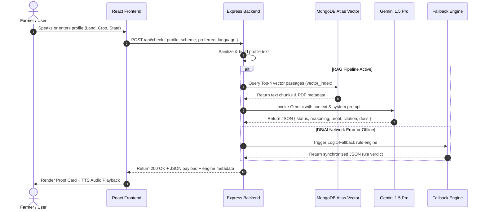

# Niti-Setu — System Architecture Document

---

## 1. High-Level Architecture Overview

Niti-Setu follows a decoupled client-server architecture designed for high availability, low latency, and graceful degradation under network or database failure.

```
+-----------------------------------------------------------------------------------+
|                                  USER / CLIENT                                    |
|   - Mobile Browser / Tablet / Desktop                                             |
+-----------------------------------------------------------------------------------+
                                         |
                                         v
+-----------------------------------------------------------------------------------+
|                                FRONTEND LAYER                                     |
|  - Framework: React 18 + Vite + Tailwind CSS `[IMPLEMENTED]`                      |
|  - UI Views: LandingPage, ProfileForm, ProofCard, LanguageSelector `[IMPLEMENTED]` |
|  - Native APIs: Web Speech STT (SpeechRecognition) & TTS (SpeechSynthesis) `[IMP]`|
|  - Multilingual Engine: 23-Language Google Translate element script `[IMPLEMENTED]`|
+-----------------------------------------------------------------------------------+
                                         |
                                 HTTP POST /api/check
                                 HTTP GET/POST /api/profile
                                         |
                                         v
+-----------------------------------------------------------------------------------+
|                                 BACKEND LAYER                                     |
|  - Server: Node.js + Express 5 `[IMPLEMENTED]`                                    |
|  - Middleware: CORS, express.json() `[IMPLEMENTED]`                              |
|  - Route Handlers: `routes/eligibility.js` `[IMPLEMENTED]`                        |
|  - Resilience Layer: Dual-Engine Switch (RAG vs Logic Fallback) `[IMPLEMENTED]`   |
+-----------------------------------------------------------------------------------+
        |                                                        |
        | (Primary Path)                                         | (Fallback Path)
        v                                                        v
+------------------------------------+         +------------------------------------+
|             AI / RAG               |         |       DETERMINISTIC FALLBACK       |
|  - Embedding: Google Gemini        |         |  - Rule Dictionary: PM-KISAN, KMY, |
|    `gemini-embedding-2-preview`    |         |    KUSUM criteria `[IMPLEMENTED]`   |
|    `[IMPLEMENTED]`                 |         |  - Localized Text Generators       |
|  - LLM: Gemini 1.5 Pro `[IMP]`     |         |    (Hindi/English) `[IMPLEMENTED]`  |
|  - Framework: LangChain `[IMP]`    |         +------------------------------------+
+------------------------------------+                            |
        |                                                         |
        v                                                         |
+------------------------------------+                            |
|          STORAGE LAYER             |                            |
|  - Database: MongoDB Atlas         |                            |
|  - Vector Index: `vector_index`    |                            |
|    over `scheme_documents`         |                            |
|    `[IN PROGRESS]` `[BLOCKED]`     |                            |
|  - Mongoose Model: `Farmer.js`     |                            |
|    `[IMPLEMENTED]`                 |                            |
+------------------------------------+                            |
        |                                                         |
        +----------------------------+----------------------------+
                                     |
                                     v
+-----------------------------------------------------------------------------------+
|                               EVIDENCE-BACKED RESULT                              |
|  JSON Payload: { status, reasoning, document_proof, citation, required_docs }     |
+-----------------------------------------------------------------------------------+
```

---

## 2. Layer Breakdown

### 1. Frontend Layer
- **Technology**: React 18, Vite, Tailwind CSS, Lucide icons.
- **Responsibilities**: User input capture, voice transcript parsing, status rendering, Proof Card display, client-side translation.
- **State Management**: React `useState` managing active views (`landing` vs `tool`), loading state, evaluation results, error state, active scheme, and preferred language code.

### 2. Backend Controller Layer
- **Technology**: Node.js 18+, Express v5, CORS middleware, dotenv configuration.
- **Responsibilities**: Endpoint routing, payload validation, profile normalization, execution orchestration, error logging to `eligibility_error.log`.
- **Deployment Adaptability**: Exported as modular Express `app` compatible with serverless environments (Vercel `vercel.json`) or standalone Node servers (`server.js`).

### 3. AI & RAG Engine Layer
- **Components**:
  - **Document Loader**: `pdf-parse` / `@langchain/community` PDFLoader reading guidelines from `backend/data/`.
  - **Text Splitter**: `RecursiveCharacterTextSplitter` (chunkSize: 1000, chunkOverlap: 200).
  - **Embeddings**: `GoogleGenerativeAIEmbeddings` (`gemini-embedding-2-preview`).
  - **LLM**: `ChatGoogleGenerativeAI` (`gemini-1.5-pro`, `temperature: 0`).
  - **Prompt Chain**: System prompt forcing strict JSON format with verbatim PDF evidence extraction.

### 4. Storage Layer
- **MongoDB Atlas Vector Search**: Collection `scheme_documents` in `niti-setu` DB. Stores 768-dimensional float vectors with metadata (`scheme_name`, `type`, `source`). `[IN PROGRESS]` `[BLOCKED]` (Blocked by cloud Atlas IP/DNS connection limits in current environment).
- **Mongoose Farmer Document Collection**: Collection `farmers` storing structured user profiles with timestamps and sparse unique indexes on `phone` and `aadhaar`.

### 5. Fallback Circuit Breaker Layer
- **Purpose**: Prevents service interruption when MongoDB Atlas DNS resolution fails (`querySrv ETIMEOUT`) or Google API key is missing/rate-limited.
- **Operation**: Intercepts RAG pipeline exceptions and executes deterministic rule evaluations for PM-KISAN, PM-KMY, and PM-KUSUM, injecting metadata `{ engine: "Logic-Fallback" }`.

---

## 6. End-to-End Data Flow Sequence


