# Niti-Setu: Visual Architecture & Roadmap

This document serves as a "whiteboard" to visualize how the core components of the Niti-Setu platform interconnect. It illustrates what has been successfully built during the MVP phase and what modules need to be attached to achieve a production-ready scale.

## 🗺️ System Architecture & Roadmap Diagram

```mermaid
graph TD
    %% Colors and Styles %%
    classDef completed fill:#d4edda,stroke:#28a745,stroke-width:2px,color:#155724;
    classDef pending fill:#fff3cd,stroke:#ffc107,stroke-width:2px,color:#856404;
    classDef future fill:#cce5ff,stroke:#004085,stroke-width:2px,color:#004085;

    %% Phase 1: Completed MVP %%
    subgraph MVP ["✅ Phase 1: MVP Core (Completed)"]
        UI["💻 React + Vite Frontend"]:::completed
        BE["⚙️ Node.js Express Backend"]:::completed
        RAG["🧠 RAG Engine (Gemini 1.5)"]:::completed
        FB["🛡️ Offline Logic Fallback"]:::completed
        PDF["📄 PDF Knowledge Base"]:::completed
        
        UI -->|Sends Profile Data| BE
        BE -->|Queries| RAG
        PDF -->|Embeddings| RAG
        RAG -.->|If Network Fails| FB
        FB -->|Returns Result| BE
        BE -->|Returns JSON| UI
    end

    %% Phase 2: Pending Integrations %%
    subgraph GAPS ["⚠️ Immediate Fixes (Pending)"]
        DB_CONN["🔌 Resolve MongoDB IP Whitelist"]:::pending
        SEC["🔐 Cloud Secrets Management"]:::pending
    end

    %% Phase 3: Production Scale %%
    subgraph PROD ["🚀 Phase 2: Production Scale (Future Work)"]
        LANG["🌐 Multilingual Support (Bhashini)"]:::future
        VOICE["🎤 Voice Input (Speech-to-Text)"]:::future
        OCR["📸 Document OCR (Aadhaar/Jamabandi)"]:::future
        USER["👤 Farmer Profiles (OTP Login)"]:::future
        CACHE["⚡ Redis Caching Layer"]:::future
        DEPLOY["☁️ Docker & Cloud Deployment (AWS/GCP)"]:::future
    end

    %% Interconnecting the Nodes %%
    RAG -->|Requires| DB_CONN
    BE -->|Requires| SEC
    
    UI -->|Needs UX Upgrade| LANG
    UI -->|Needs UX Upgrade| VOICE
    UI -->|Needs UX Upgrade| OCR
    UI -->|Needs Auth| USER
    
    BE -->|Needs Optimization| CACHE
    MVP -->|Migration to Cloud| DEPLOY
```

---

## 📝 Roadmap Breakdown

### ✅ 1. What We Have Done (Green Nodes)
We have successfully built the end-to-end flow of the application:
*   **The Frontend (`UI`)** captures user input beautifully.
*   **The Backend (`BE`)** securely marshals that data to our **AI Engine (`RAG`)**.
*   **The Offline Fallback (`FB`)** acts as our safety net. If the database goes down, the system intercepts the error and calculates eligibility using synchronized, hardcoded rules from the **Knowledge Base (`PDF`)**.

### ⚠️ 2. Immediate Blockers (Yellow Nodes)
To make the AI engine the permanent primary source of truth:
*   **MongoDB Connectivity (`DB_CONN`)**: We must configure the MongoDB cluster's network rules to permanently allow connections from our backend so the RAG engine can stream live rule context.
*   **Secrets (`SEC`)**: Sensitive API keys must be moved out of local environments and into a cloud vault.

### 🚀 3. Path to Production (Blue Nodes)
To scale this from a hackathon prototype to a national platform used by millions of rural farmers:
*   **Accessibility (`LANG` & `VOICE`)**: We must plug regional language translation and voice-recognition modules directly into the React Frontend so illiterate farmers can speak to the app in their native tongue.
*   **Frictionless UX (`USER` & `OCR`)**: We need to attach an authentication database so farmers don't have to re-enter data. By attaching an OCR module, farmers can simply take a photo of their land papers, and the UI will auto-fill the form.
*   **Scale (`CACHE` & `DEPLOY`)**: A Redis cache between the Backend and the AI Engine will save massive API costs by remembering recent answers. Finally, wrapping everything in Docker allows the entire ecosystem to scale up during heavy agricultural seasons.
